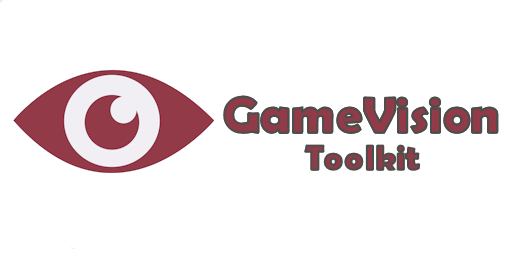

<a href="https://tinybiggames.com" target="_blank"></a>

[](https://discord.gg/tPWjMwK) [](https://github.com/tinyBigGAMES/GameVision/stargazers) [](https://github.com/tinyBigGAMES/GameVision/network/members) [](https://github.com/tinyBigGAMES/GameVision/network/members)
[](https://twitter.com/tinyBigGAMES)

## Overview
GameVision Toolkit&trade; is a 2D professional indie game library that allows you to do game development in <a href="https://www.embarcadero.com/products/delphi" target="_blank">Delphi</a> for desktop PC's running Microsoft Windows® and uses OpenGL® for hardware accelerated rendering.

It's robust, designed for easy use and suitable for making all types of 2D games and other graphic simulations, You access the features from a simple and intuitive API, to allow you to rapidly and efficiently develop your projects. There is support for bitmaps, audio samples, streaming music, video playback, loading resources directly from a compressed and encrypted archive, a thin object oriented actor/scene system, entity state machine, sprite management, collision detection and much more. GameVision Toolkit, easy, fast & fun!

## Downloads
<a href="https://github.com/tinyBigGAMES/GameVision/archive/refs/heads/main.zip" target="_blank">**Development**</a> - This build represents the most recent development state an as such may or may not be as stable as the official release versions. If you like living on the bleeding edge, it's updated frequently (often daily) and will contain bug fixes and new features.

<a href="https://github.com/tinyBigGAMES/GameVision/releases" target="_blank">**Releases**</a> - These are the official release versions and deemed to be the most stable.

Visit <a href="https://tinybiggames.com" target="_blank">tinyBigGAMES</a> website for the latest news, updates, downloads and licensing information.

## Features
- **Free** for commercial use. See <a href="https://github.com/tinyBigGAMES/GameVision/blob/main/LICENSE" target="_blank">License agreement</a>.
- Written in **Object Pascal**
- Support Windows 64 bit platform
- Hardware accelerated with **OpenGL**
- You interact with GameVision via the global `GV` object and various classes in the toolkit
- **Archive** (custom archive format, password protection)
- **Display** (OpenGL, anti-aliasing, vsync, viewports, primitives, blending)
- **Input** (keyboard, mouse and joystick)
- **Bitmap** (color key transparency, scaling, rotation, flipped, titled,  BMP, DDS, PCX, TGA, JPEG, PNG)
- **Video** (play, pause, rewind, OGV format)
- **Sprite** (pages, groups, animation, poly-point collision)
- **Entity** (defined from a sprite, position, scale, rotation, collision)
- **Actor** (list, scene, state machine)
- **Audio** (samples, streams, WAV, OGG/Vorbis, FLAC formats)
- **Speech** (multiple voices, play, pause)
- **Font** (true type, scale, rotate)
- **Timing** (time-based, frame elapsed, frame speed)
- **Shaders** (vertex, pixel, GLSL)
- **Misc** (collision, easing, screenshake, screenshot, starfield, colors, INI based config files, startup dialog, treeview menu)

## Minimum System Requirements
- <a href="https://www.embarcadero.com/products/delphi/starter" target="_blank">Delphi Community Edition</a>
- Microsoft Windows 10, 64 bits
- OpenGL 3

## How to use in Delphi
- Unzip the archive to a desired location.
- Add `installdir\libs`, folder to Delphi's library path so the toolkit source files can be found for any project or for a specific project add to its search path.
- In Delphi, load `GameVision Toolkit.groupproj` to load and compile the project files.
- Use `GVArc` utility for making archive files (standard password protected zip format). Running the `makearc.bat` in `installdir\examples\bin` will build `Data.zip` that is used by the examples.
- See examples in the `installdir\examples` for more information about usage.

## Known Issues
- This project is in active development so changes will be frequent 
- Documentation is WIP. They will continue to evolve
- More examples will continually be added over time

## A Tour of GameVision Toolkit
### Game Object
You just have to derive a new class from the `TGVGame` base class and override a few callback methods. You access the toolkit functionality from the `GameVision` unit.
```pascal
uses
  GameVision;

type
  { TMyGame }
  TMyGame = class(TCustomGame)
  protected
    FFont: TFont;
  public
    procedure OnSetSettings(var aSettings: TGVSettings); override;
    procedure OnStartup; override;
    procedure OnShutdown; override;
    procedure OnUpdateFrame(aDeltaTime: Double); override;
    procedure OnRendeFrame; override;
    procedure OnRendeFramerHUD; override;
  end;
```
### How to use
A minimal implementation example:
```pascal
uses
  System.SysUtils;

{ TMyGame }
procedure TMyGame.OnSetSettings(var aSettings: TGVSettings);
begin
  inherited;
  
  // add your settings code  
  aSettings.WindowWidth := 960;
  aSettings.WindowHeight := 540;
  aSettings.WindowTitle := 'My Game';
  aSettings.WindowClearColor := DARKSLATEBROWN;  
end;

procedure TMyGame.OnStartup;
begin
  inherited;
  
  // add your own startup code
end;

procedure TMyGame.OnShutdown;
begin
  // add your shutdown code
  
  inherited;
end;

procedure TMyGame.OnUpdateFrame(aDeltaTime: Double);
begin
  inherited;
  
  // add your update code
end;

procedure TMyGame.OnRenderFrame;
begin
  inherited;
  
  // render your render code
end;

procedure TMyGame.OnRenderHUD;
begin
  inherited;
  
  // add your render HUD code 
end;
```
To run your game, call
```pascal
GVRunGamen(TMyGame);
```
**NOTE:** For GameVision to work properly, execution MUST start with `GVRunGame(...)`. This call will property setup/shutdown the library and log and handle errors. Only one GameVision app instance is allowed to run and will safely terminated if more than one is detected.

See the examples for more information on usage.

## Media

https://user-images.githubusercontent.com/69952438/167311207-e98f65e2-091f-4b0b-a4ef-53965c1d4ad4.mp4


## Support
<table>
<tbody>
	<tr>
		<td>Project Discussions</td>
		<td><a href="https://github.com/tinyBigGAMES/GameVision/discussions">https://github.com/tinyBigGAMES/GameVision/discussions</a></td>
	</tr>
	<tr>
		<td>Project Tracking</td>
		<td><a href="https://github.com/tinyBigGAMES/GameVision/projects">https://github.com/tinyBigGAMES/GameVision/projects</a></td>
	</tr>	
	<tr>
		<td>Website</td>
		<td><a href="https://tinybiggames.com">https://tinybiggames.com</a></td>
	</tr>
	<tr>
		<td>E-Mail</td>
		<td><a href="mailto:support@tinybiggames.com">support@tinybiggames.com</a></td>
	</tr>
	<tr>
		<td>Discord</td>
		<td><a href="https://discord.gg/tPWjMwK">https://discord.gg/tPWjMwK</a></td>
	</tr>
	<tr>
		<td>Twitter</td>
		<td><a href="https://twitter.com/tinyBigGAMES">https://twitter.com/tinyBigGAMES</a></td>
	</tr>
	<tr>
		<td>Facebook Page</td>
		<td><a href="https://facebook.com/tinyBigGAMES">https://facebook.com/tinyBigGAMES</a></td>
	</tr>
	<tr>
		<td>Facebook Group</td>
		<td><a href="https://www.facebook.com/groups/gamevisiontoolkit">https://www.facebook.com/groups/gamevisiontoolkit</a></td>
	</tr>		
	<tr>
		<td>YouTubeo</td>
		<td><a href="https://vimeo.com/tinyBigGAMES">https://youtube.com/tinyBigGAMES</a></td>
	</tr>
</tbody>
</table>

<p align="center">
 <a href="https://www.embarcadero.com/products/delphi" target="_blank"></a><br/>
 <b>Made for Delphi</b>
</p>

